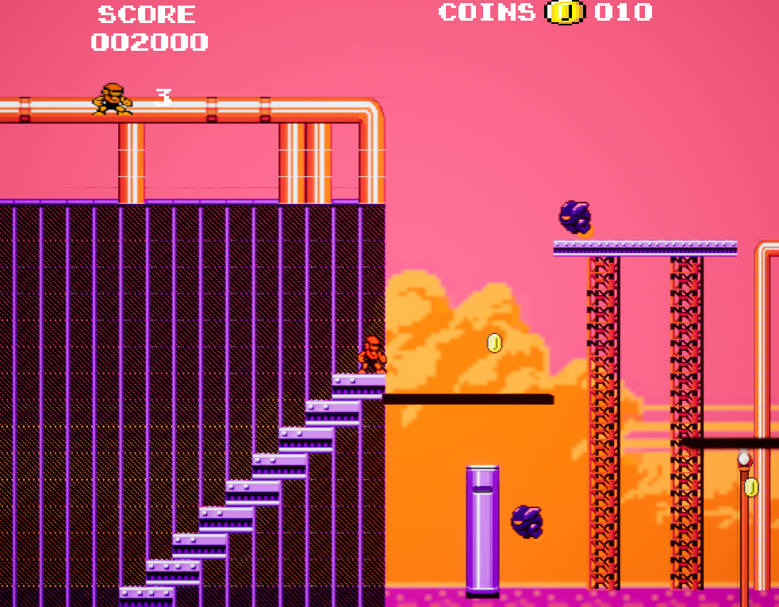

# This project is 2d game mario/megaman like.
## Sample demo https://youtu.be/oG9eq_O-C1I
Created in UE5. To work you need to download this repo and paste content into your project. In maps there are lvls.
Stuff is programed in blueprints that are in conctent file.
Sample screenshots:

